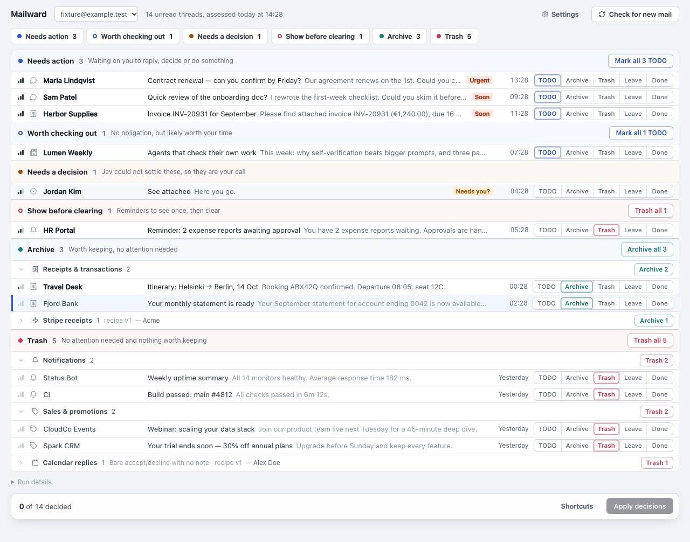

# Mailward

Review-first triage for unread Gmail. Mailward reads each unread thread once,
proposes what to do with it, and puts every thread on one review page. You confirm
or change each proposal. Gmail changes only when you press **Apply**, and every
action can be undone.



- **Six sections on one page:** Needs action, Worth checking out, Needs a decision,
  Show before clearing, Archive and Trash.
- **Guidance you write.** Short guidance cards tell the model what matters to
  you. Each row can show exactly what the model saw.
- **Recipes handle the obvious mail.** Filters for receipts, calendar replies and sign-in
  codes skip the model. You still review what they propose.
- **Reversible changes.** Trash is Gmail trash, never permanent deletion. Archive marks
  the thread read. TODO adds a label and keeps it unread.

Assessment uses [Jev](https://openrouter.ai/docs/guides/community/jev), TypeSafe's
decision model on OpenRouter. Jev returns typed answers with probabilities.
You provide your own OpenRouter key.

## Try the demo

You need [Bun](https://bun.sh). You don't need a Google or OpenRouter account.

```bash
bun install
bun run demo
```

The demo opens at http://localhost:4873 with a sample inbox. You can review and
open rows and edit settings. The demo has no Gmail connection, so **Apply** and
**Check for new mail** won't work.

## Set up with your Gmail

```bash
bun install
cp .env.example .env   # fill in the values below
bun run dev            # http://localhost:4873
```

**Google OAuth**

1. Create a project at [console.cloud.google.com](https://console.cloud.google.com)
   and enable the **Gmail API**.
2. Configure the OAuth consent screen. While the app is in **Testing** status,
   add your own address under **Test users**. Google expires refresh tokens for
   testing apps after about a week. When that happens, Mailward shows a
   **Reauthorize** button.
3. Create **Web application** credentials with the redirect URI
   `http://localhost:4873/auth/callback`.
4. Copy the client ID and secret to `GOOGLE_CLIENT_ID` and `GOOGLE_CLIENT_SECRET`.

**OpenRouter.** Create a key at [openrouter.ai/keys](https://openrouter.ai/keys),
add some credit, and set it as `OPENROUTER_API_KEY`.

Open the app, connect your account, and finish the short setup: your name and role,
starter guidance and suggested recipes. Then choose **Check for new mail**.

## Cost

Jev bills input tokens only, at **$0.042 per million**. That was the listed
price in September 2026; the
[model page](https://openrouter.ai/typesafe/jev-1.13) has the current rate.
A typical thread uses about 5,000 tokens.

| | Approximate cost |
|---|---|
| One thread | $0.0002 |
| A check of 100 unread threads | $0.02 |
| A daily 100-thread check for a month | $0.60 |

Recipe matches cost nothing, and so do threads that were already assessed and haven't changed.

## Privacy

All state, including your Google tokens, stays in one local SQLite file
(`./data/emails.db`). For each unread thread that no recipe handles, Mailward
sends OpenRouter the headers, clipped body text, links and calendar details,
together with your guidance. Mailward has no login of its own, so run it only
on localhost.

## Daily use

1. **Check for new mail.** Mailward scans unread inbox threads from the last 30 days.
2. **Review.** A ring marks the proposal and a filled button marks your choice.
   A dashed ring marks a tentative suggestion on a row Jev couldn't decide.
   Section buttons accept all remaining proposals in that section.
   **Done** means you've handled the thread, and asks what should happen to it next.
3. **Apply.** Apply is the only step that changes Gmail. Choices you haven't
   applied survive a reload, and you can undo each applied action.

| Key | Action |
|---|---|
| `j` / `k` | Next / previous row |
| `y` | Accept the proposal |
| `t` `e` `#` `l` `d` | TODO, Archive, Trash, Leave, Done |
| `o` | Open the row |
| `?` | All shortcuts |

To improve proposals, edit your guidance and recipes on **Settings**. Edits to
guidance are versioned, and you can restore an earlier version. A coding agent
can also review your feedback and suggest guidance changes. See
[AGENTS.md](AGENTS.md).

## Limitations

- Supports Gmail only, for one user on localhost.
- Compares deadlines in `Europe/Helsinki` time.
- Applies nothing automatically.

## Contributing

[AGENTS.md](AGENTS.md) is the developer guide for people and coding agents.
